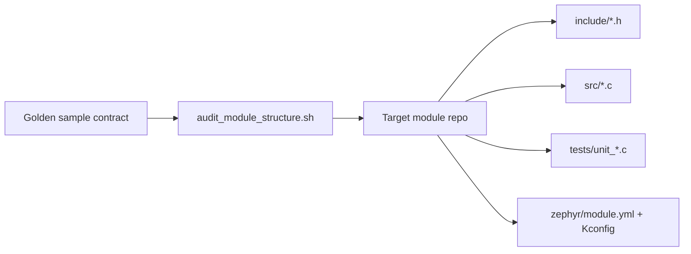
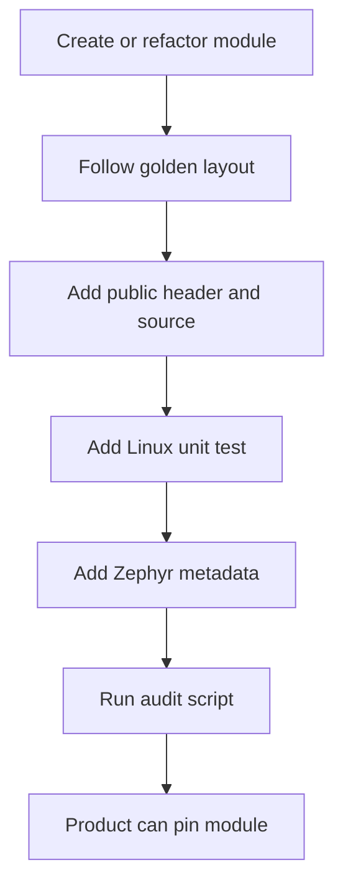

# dephy_module_golden_sample

Golden sample for reusable C/Zephyr Dephy modules.

## Overview

This repo is the executable reference for reusable module structure. Use it to
start a new module or audit real modules for missing public API, source, tests,
Zephyr metadata, docs, or TODO files.

## Key Value

- Defines the expected reusable C/Zephyr module contract.
- Includes a minimal public API, portable C source, Linux unit test, and Zephyr
  metadata.
- Provides `scripts/audit_module_structure.sh` to check real module repos.
- Keeps product-specific workflow out of reusable module repos.

## How To Use

```sh
make -f Makefile.linux test
scripts/audit_module_structure.sh ../dephy_industrial_io ../modbus_zephyr_esp32 ../mqtt_min_broker
scripts/test_zephyr_module.sh --metadata-only
```

## Architecture Flow



## Example User Scenario



## Simple Principle

A reusable module should be buildable, testable, and auditable before any
product depends on it.

## Systematic Regression Testing

From the workspace root, run the shared pytest regression module:

```sh
../dephy_testkit/.venv/bin/python -m pytest ../dephy_testkit/tests/regression --module dephy_module_golden_sample
../dephy_testkit/.venv/bin/python -m pytest ../dephy_testkit/tests/regression --module dephy_module_golden_sample --profile integration
```

The local repo test remains:

```sh
make -f Makefile.linux test
```

`make -f Makefile.linux test` is the canonical local entry point and must
trigger suites through `dephy_testkit` via `scripts/trigger_testkit.sh`. Keep
direct targets such as `direct-test` available for debugging, but route default
and CI-style runs through `testkit-*` wrappers. When a test case or script
changes, update both the direct Makefile target and the testkit wrapper.

## Docs

- `docs/module_structure.md`: full reusable module contract.
- `docs/todo.md`: current TODO summary.

## License

MIT. See `LICENSE` and `NOTICE.md`. Reuse and references are allowed, but the
copyright notice and attribution to Judd (judadao) must be preserved.
